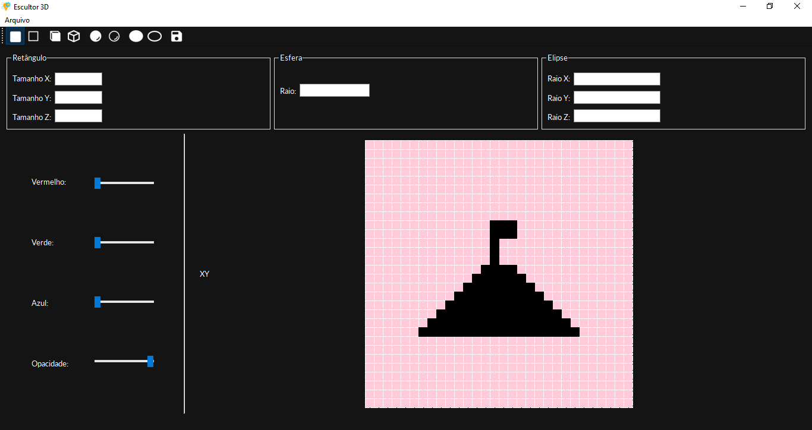
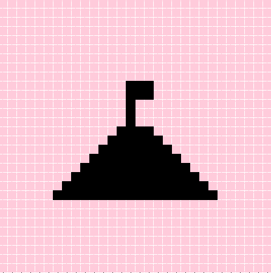

# [DCA1202] Interface de Escultor 3D

Trabalho da 3ª unidade da disciplina de Programação Avançada/UFRN, consiste na construção da interface gráfica de um escultor 3D que permite ao usuário desenhar algumas formas pré-determinadas, como box, sphere, ellipsoide, além de voxels individuais em uma matriz de desenho de tamanho estabelecido pelo mesmo.Também é possível ao usuário apagar o que foi desenhado.

O Scultor3D é uma aplicação desenvolvida em C++ com o framework gráfico do Qt Creator, que permite o desenho de objetos tridimensionais utilizando Voxels, e salvando no formato de arquivo suportado pela `.off `.

Com uma interface bastante intuitiva, qualquer usuário será capaz de utilizá-la sem dificuldade. O espaço destinado ao desenho é uma  malha quadriculada (imagem  abaixo). Nesta malha, colocamos um exemplo de ilustração.

### Interface

Existem cinco áreas no programa: 
+ Retângulo(topo esquerda): medidas XYZ para desenhar o voxel e o box. Também servem de dimensão de suas borrachas.
+ Esfera(topo meioa): medida do raio para desenhar a esfera. Também servem de dimensão da sua borracha.
+ Elipse(topo direita): medidas XYZ para desenhar o ellipsoide. Também servem de dimensão da sua borracha.
+ Sliders(base à esquerda): botões de deslizar para alterar as cores e opacidade. As cores seguem o padrão RGBA (red. green, blue e alfa), onde o alfa/opacidade representa a transparência.
+ Tela (base à direita): é a malha quadriculada, onde você poderá ver em tempo real um _preview_ do que está sendo desenhado.

-----------------------------------

### Matriz de Desenho

A aplicação inicia com uma matriz de desenho de 10x10x10 voxels, mas o usuário pode alterar a matriz de desenho para outras dimensões em File>New 3D Canvas. **AVISO:** isso irá apagar qualquer desenho não salvo.

------------------------------------

### Para desenhar

Para começar a desenhar basta clicar na malha, manter o botão pressionado e arrastar o mouse. Caso o usuário prefira outra forma, basta selecionar algum dos ícones que ficam na parte superior esquerda da janela de desenho (imagem abaixo). Na ordem, eles são: desennhar voxel, apagar voxel, desenhar caixa, apagar caixa, desenhar esfera, apagar esfera, desenhar elipsóide e apagar elipsóide.

------------------------------------------

Após clicar na forma de desenho que você achar mais apropriada, o próximo passo é selecionar as dimensões da forma escolhida. Os espaços destinados ao armazenamento dessas informações estão na parte superior da janela e podem ser vistos na primeira figura. Cada forma tem suas dimensões e é importante lembrar de preencher todas as dimensões da forma escolhida e nunca botar números negativos.

### Salvando no formato .off

Atualmente, o único formato de arquivo possível para exportar a escultura de voxels é o formado .off. Formato também utilizado para a visualização de objetos 3D. Para poder visualizar a imagem gerada no programa de forma correta, devemos abrir o arquivo .off em softwares especiais, como: o meshlab.

Para salvar seu arquivo em .off basta clicar no último botão da barra de ferramentas ou ir em File>Save as .off. Ambas as opções irão abrir um diálogo para salvar seu arquivo no local que o usuário preferir.
